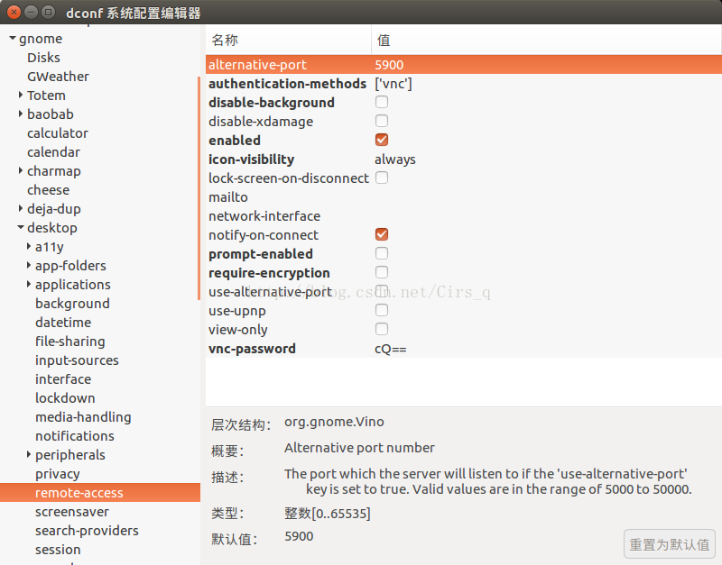
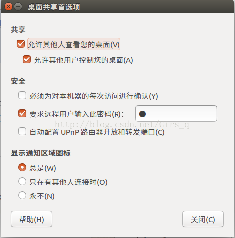
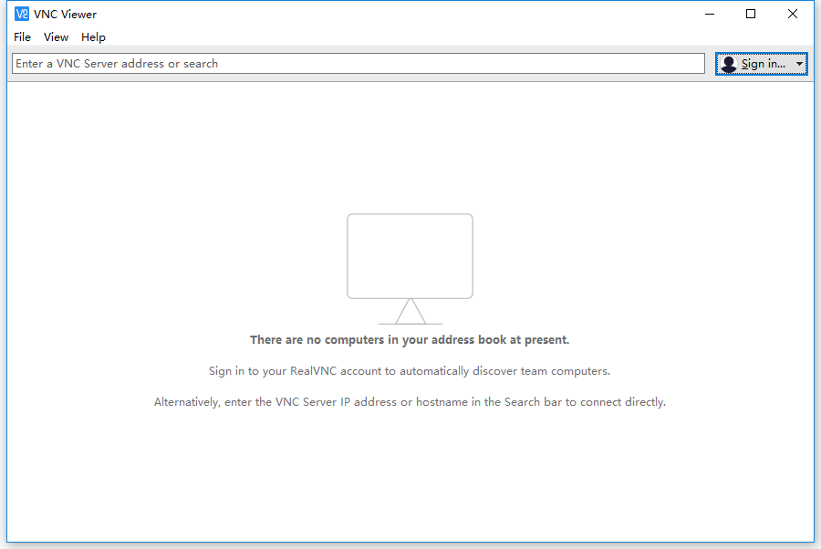
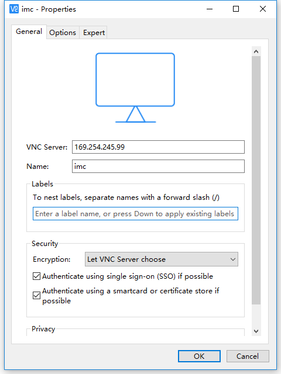
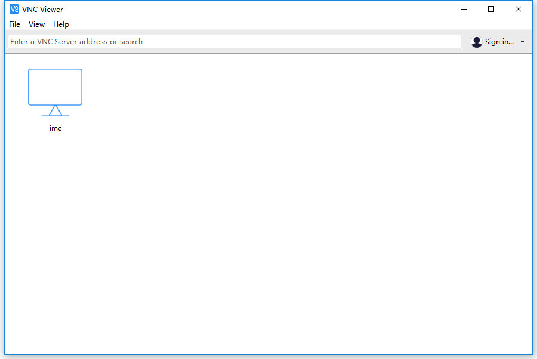
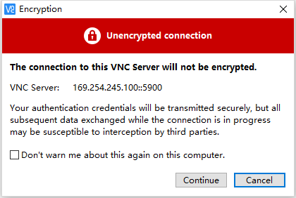
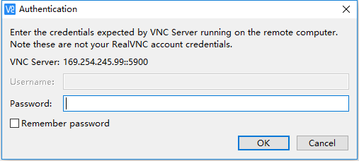
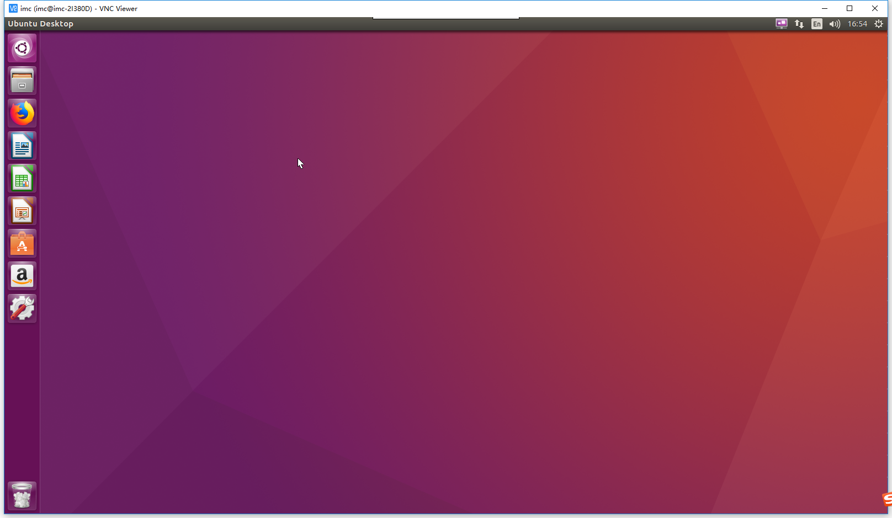

## Windows 10 通过 vnc 远程控制 Ubuntu 16.04 桌面

[TOC]

### 1. Ubuntu 16.04 配置

#### 1）使用前说明

将 Windows 系统电脑和 Ubuntu 系统电脑的网络设置在同一个网段，可以用无线或有有线网络，本教程是用有线网络测试的。

#### 2) 安装 dconf-editor 

安装命令： sudo apt-get install dconf-editor 

#### 3) 运行 dconf-editor

**注意一定要用当前用户来运行，不能加sudo** 

~~~
$ dconf-editor 
~~~

依次展开org->gnome->desktop->remote-access，配置成如图所示的效果




#### 4) 允许Uubuntu 远程控制

在 dash 搜索里面输入 Desktop Sharing (中文 Ubuntu 输入桌面共享），配置成这样：



**注意远程用户输入此密码即是在 Windows 上登录时输入的密码。**


#### 5）配置ubuntu firewall 

```
sudo ufw allow 5900 
```


### 2. Windows 10 配置

#### 1) 下载 vnc viewer

[下载网址](https://www.realvnc.com/en/connect/download/viewer/)，根据自己的电脑版本选择 64 位的还是 32 位的。下载完成后可以直接运行。

#### 2）vnc viewer 配置

打开 vnc viewer 界面，如图：



选择 File ->  New connection , 配置如下：



**注意 VNC Server 为远程控制的 Ubuntu 电脑 ip, Name 为指定的名字，和 Ubuntu 电脑的名字无关。**

配置完成如下：



单击 imc 的 Connect 进行连接，若提示下面界面：



忽略不用管，点击 Continue 后会提示输入密码，如下图：



密码为配置 Ubuntu 远程控制时的密码。正确输入密码后，可以看到能够远程控制，如下图：



