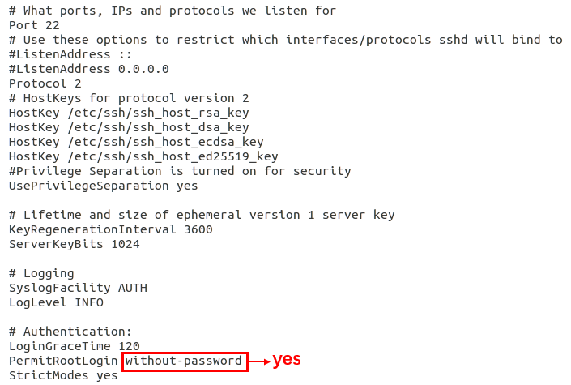

## linux ssh远程桌面和传输文件

[TOC]

#### 1. ssh 安装

查看ssh是否安装：ps -e|grep ssh

安装ssh:  sudo apt-get install ssh

ssh 开启: service ssh restart

#### 2. Linux 系统允许root账号远程登录

* 获得管理员权限: sudo -s 

* 设置root用户的密码: sudo passwd root

* 修改配置项, 输入 sudo gedit /etc/ssh/sshd_config , 将PermitRootLogin 配置项将原先的without-password修改为 yes , 如下图：

  

  保存，退出。

* 重启 ssh服务: service ssh restart

#### 3. 远程桌面

假设两台机器A，B，都是Linux主机，A为本地主机(即用于控制其他主机的机器)，B为远程主机(即被控制的机器Server), 假如ip为169.254.245.90， A用root权限远程控制B。

在远程主机B的 Desktop Sharing 中设置如下：

在本地主机A的 Remmina Remote Desktop Client 设置如下：

Protocol 选为 VNC-Virtual Network Computing；

Server 设置需要连接的远程主机 ip；

User name 设置为 root 可以拷贝文件；

Password 为上一步中的设置的密码。

#### 3. 拷贝文件

假设两台机器A，B，都是Linux主机，A为本地主机(即用于控制其他主机的机器)，B为远程主机(即被控制的机器Server), 假如ip为169.254.245.90。

在本地主机A上做如下设置：

~~~c++
sudo -s // 进入 root  权限
ssh-keygen -t rsa // 连续三次回车,即在本地生成了公钥和私钥,不设置密码
ssh 169.254.245.90 "mkdir .ssh;chmod 0700 .ssh"   // 需要输入密码，为远程主机B的root密码
scp ~/.ssh/id_rsa.pub 169.254.245.90:.ssh/id_rsa.pub // 需要输入密码，为远程主机B的root密码
~~~

在远程主机B上做以下设置：

~~~c++
sudo -s // 进入 root  权限
touch ~/.ssh/authorized_keys // 如果已经存在这个文件, 跳过这条命令
chmod 600 ~/.ssh/authorized_keys //如果前面已经存在这个文件, 可以跳过这条，但一定要保证文件属性只有owner可读
cat ~/.ssh/id_rsa.pub >> ~/.ssh/authorized_keys // 将id_rsa.pub的内容追加到 authorized_keys 中
~~~

从本地主机A拷贝文件到远程主机B(不需要进入root)：

~~~c++
scp /home/wb/readme.md root@169.254.245.90:/home/cheng // 拷贝 /home/wb/readme.md 到远程主机B的/home/cheng目录下，需要输入密码，为远程主机B的root密码
~~~

正常情况下如下图所示：

